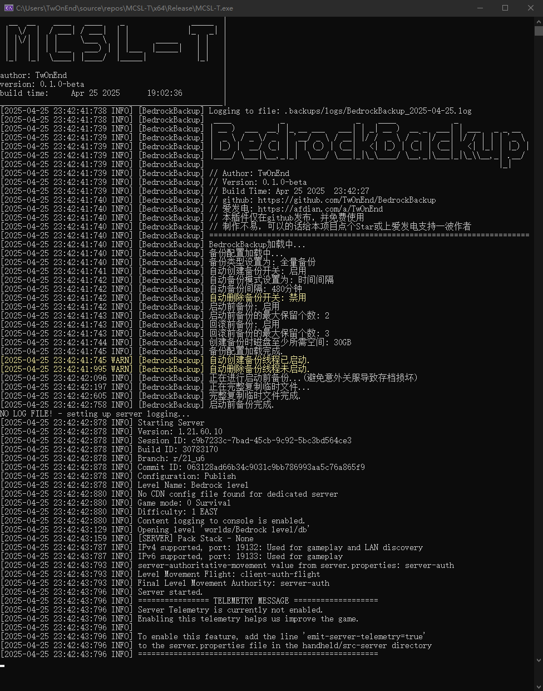

# 🗃️ BedrockBackup

**Minecraft基岩版服务端多策略备份解决方案**

---


## 📦 功能概览

- **热备份/恢复**：支持全量/差异备份，快速回滚存档
- **删除/查询**：删除和查询全量/差异备份
- **定时任务**：自动备份、自动清理
- **多模式触发**：定时备份或按固定间隔执行
- **安全防护**：使用原生指令保证存档完整性、启动/回滚操作前自动创建保险备份等

## 💡 工作原理

1. `MCSL-T.exe`使用 Windows API 管道与`bedrock_server.exe`通信，并加载 `BedrockBackup.dll`
2. 创建备份时，使用`bedrock_server.exe`原生指令`/save hold|query|resume`，确保存档完整性；
   参考：与`bedrock_server.exe`同目录的文件`bedrock_server_how_to.html`，中的【Backups】部分

## 🛠️ 安装与配置

### 1. 文件结构

```
MCSL-T/
├── .backups/                # 备份存档存放目录
│   ├── full/                # 全备份 存放目录
│   ├── diff/                # 差异备份 存放目录
│   ├── rollback/            # 回滚前临时备份 存放目录
│   ├── startup/             # 启动前临时备份 存放目录
│   └── logs/                # 备份插件操作日志记录
│
├── .dll/ # 插件目录
│   └── BedrockBackup/                  # 备份插件目录
│   	├── BedrockBackup.dll           # 备份插件
│   	└── BedrockBackup_config.json   # 配置文件
│
├── .server_bedrock/         # BDS服务端存放目录
│
└── MCSL-T.exe               # 主程序
```

### 2. 首次运行

1. 确保`BedrockBackup.dll`在`.dll/BedrockBackup/`目录中
2. 启动`MCSL-T.exe`，自动生成默认配置文件

## 📌 使用BedrockBackup功能

### 1. 创建备份 `backup make [note]`

```
根据当前备份类型 创建一个备份
[note]: 给创建的备份一个注释，若不填，默认为“空”
例：backup make 我是一个备份
创建一个.zip备份，并给该备份名称添加“我是一个备份”
```

### 2. 删除备份 `backup remove [index]`

```
根据当前备份类型 删除选择的备份
[index]: 选择要删除备份的编号，查看编号用"backup list [pag]"指令查看
例：backup remove 5
删除选择编号为 5 的备份
```

### 3. 列出备份 `backup list [pag]`

```
查看当前备份类型的全部备份 与 信息状态
[pag]: 选择查看的页码
例：backup list 2
查看第 2 页的备份`
```

### 4. 回滚备份 `backup restore [index]`

```
根据当前备份类型 回滚选择的备份
[index]: 选择要回滚备份的编号，查看编号用"backup list [pag]"指令查看
例：backup restore 9
回滚选择编号为 9 的备份
```

### 5. 重载配置文件 `backup reload`

```
修改配置文件后，输入指令即可重载配置文件
注意：自动创建/清理备份功能开关，无法热重载，必须重启
```

### 6. 帮助 `backup help`

```
如果忘了上述指令，输入这个即可...
```

## ⚙️ 配置文件详解

### 备份策略 (`backup_strategy`)

```
{
  // 备份模式
  // Full           全备份 - 备份所有存档文件
  // Differential   差异备份 - 只备份自上次全备份以来的变化
  "current_backup_type": "Full", // 默认: Full

  // 自动备份
  "auto_backup": {
    // 开关
    "enabled": true, // 默认: true

	// 自动备份模式
	// TimeInterval   按固定时间间隔触发备份
	// ScheduledTime  按指定时间点触发备份
    "trigger_mode": "TimeInterval", // 默认: TimeInterval

	// 按固定时间间隔触发备份 (分钟)
	// 当trigger_mode为TimeInterval时有效
    "interval_minutes": 480, // 默认: 480 | 不可小于30

	// 按指定时间点触发备份
	// 当trigger_mode为ScheduledTime时有效
    "scheduled_times": [
      {05, 00}, // 默认计划时间1: 凌晨5点
      {13, 00}, // 默认计划时间2: 下午1点
      {23, 00}  // 默认计划时间3: 晚上11点
    ]
  }
}
```

### 自动清理 (`auto_cleanup`)

```
{
  // 开关
  "enabled": false, // 默认: false

  // 清理模式
  // ByAge,                // 删除超过最大保留时间的备份
  // ByAgeAndAutoCreated,  // 删除超过最大保留时间且由自动创建的备份
  // ByCount,              // 只保留最近N个备份
  // ByCountAndAutoCreated // 只保留最近N个且由自动创建的备份
  "cleanup_mode": "ByAge", // 默认: ByAge

  // 检查清理时间 (分钟)	  
  "check_interval_minutes": 480, // 默认: 480 | 不可小于30

  // 最大保留时间 (小时)
  // 当cleanup_mode为ByAge或ByAgeAndAutoCreated时有效
  "max_backup_age_hours": 24, // 默认: 24

  // 最大保留个数
  // 当cleanup_mode为ByCount或ByCountAndAutoCreated时有效
  "max_backups_to_keep": 5, // 默认: 5
}
```

### 安全管理 (`safety_config`)

```
{
  // 启动前备份
  "startup_safety": {
	// 开关
    "keep_startup_backups": true, // 默认: true

	// 启动前备份的最大保留个数 (n+1)
    "max_startup_backups_to_keep": 2 // 默认: 2
  },

  // 回滚前备份
  "rollback_safety": {
	// 开关
    "keep_rollback_backups": true, // 默认: true
	
	// 回滚前备份的最大保留个数 (n+1)
    "max_rollback_backups_to_keep": 3 // 默认: 3
  }
}
```

### 系统限制 (`system_limits`)

```
{
  // 创建备份时磁盘至少所需空间 (GB)
  "minimum_required_disk_space_gb": 30 // 默认: 30
}
```

## ❓ 常见问题

**Q：这是什么，~~前面叽里咕噜的说什么呢，看不懂~~**

`A：这是我的世界服务端地图存档备份工具，用来保证游戏存档的安全`

---

**Q：支持哪种服务端，Java版服务端可以吗？**

`A：仅支持基岩版服务端（BDS）`
作者尝试过Java版服务端，服务端可以正常运行（不含BedrockBackup功能）
如果想运行Java版服务端，有更好的选择[MCDReforged](https://mcdreforged.com/zh-CN "MCDReforged")

---

**Q：备份的时候需要关闭服务端吗？**

`A：无需关闭服务端就可以进行备份（热备份）`
另外，启动前/回档前备份这两种是冷备份

---

**Q：服务端在运行中进行备份，能保证备份后数据的完整性吗？**

`A：能的，兄弟能的`（本方案的优点之一，使用了服务端原生/save query指令，BedrockBackup能根据其内容进行复制和截断

---

**Q：差异备份如何工作？**

A：基于当月的全量备份，仅保存变化的数据

---

**Q：备份失败怎么办？**

1. 检查 `.backups/logs/` 中的日志
2. 确认磁盘剩余空间 > `BedrockBackup_config.json`中设置的大小
3. 重启服务端后重试

---

**Q：还有更多问题？**

`A1：欢迎加群提问，QQ群：1001583480`

`A2：有bug，请提交issues，并详细说明问题`

## ✨ 支持作者

⭐️Star：给本项目点个Star😋

⚡[爱发电](https://afdian.com/a/TwOnEnd)：https://afdian.com/a/TwOnEnd

## 📜 本项目使用以下第三方库：

[nlohmann/json](https://github.com/nlohmann/json)

[Zip-Utils](https://www.codeproject.com/KB/files/zip_utils/zip_utils_src.zip)


